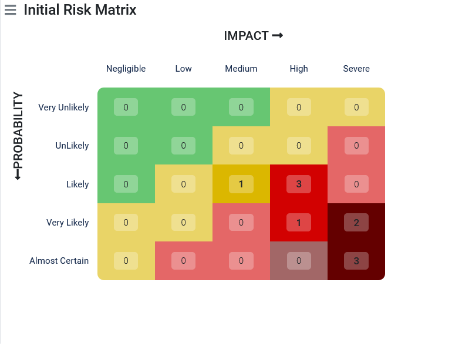

# Correction exercice 3 : analyse de risques

Pour réaliser une analyse de risques, vous pouvez vous appuyer sur votre analyse SWOT.
Attention, il y a des risques que vous pouvez identifier qui ne concernent pas spécifiquement votre projet, mais le SI dans la globalité comme par exemple : 
- Hébergement des applications
- Politique de sécurité des applications
- Politique de sécurité des bases de données
- RGPD

L'analyse des risques à réalisé ici doit se concentrer sur les risques futurs identifiables et quantifiables liés directement au projet actuel.

---

## Risques

### Axe coût

#### Causes

- Pas de budget établit avec le client
- S'aligner pour remporter l'appel d'offre (risque de réduire la marge commerciale ou d'être en perte)
- Cout faible si on part sur une solution qui nécessite uniquement de l'administration (être cohérent de la mobilisation de l'équipe en partant sur cette solution)

#### Conséquences

- Mauvaise évaluation des ressources

#### Contre-mesures préventives

- Consacrer plus de temps à la budgétisation du projet.
- Bien comprendre les besoins en multipliant les entretiens avec le client.
- Refuser le projet si la marge commerciale est trop basse.

#### Contre-mesures de réparation

- Reduction de la marge commerciale en respectant les règles appliquées dans l'entreprise

---

### Axe délais

#### Causes

- Pas d'estimation de temps établie (planning)
- Equipe indisponible

#### Conséquences

- Pas d'affection des ressources sur le projet

#### Contre-mesures préventives

- Prendre davantage de marge sur  la(es) date(s) de livraison
- Connaitre les disponibilités des membres de l'équipe en consultant les affectations des collaborateurs dans les projets et les agenda

#### Contre-mesures de réparation

- Faire appel à de la sous-traitance

---

### Axes qualité et périmètre fonctionnel

#### Causes

- Besoins mal définis par le client, risque d'avoir des fonctionnalités qui ne répondent pas aux besoins du client
- Première vue, volume faible des fonctionnalités mais le volume de fonctionnalités risque d'être important, attention à la mobilisation des ressources humaines.

#### Conséquences

- Nouveaux besoins
- Décalage dans le planning (date fin du projet repoussée)

#### Contre-mesures préventives

- Bien définir le périmètre fonctionnel
- Bien prioriser les fonctionnalités (développer les fonctionnalités critiques et importantes en premiers, se mettre d'accord avec le client pour réduire le périmètre fonctionnel dans l'hypothèse où le budget de ce dernier est insuffisant)

#### Contre-mesures de réparation

- Développer et livrer moins de fonctionnalités (uniquement les plus prioritaires ou avec le plus de valeur)

---

### Axe équipe

#### Causes

- Peu d'expérience dans ce type de projet malgré la maitrise technique.
- Peu de compétences dans le CMS Wordpress
- Peu d'expérience dans la gestion et pilotage du projet
- Peu de connaissance sur le domaine d'activité
- Process internes non définis ou flous car les profils sont jeunes dans l'entreprise

#### Conséquences

- Difficultés techniques qui retarderont les échéances et n'aboutiront pas à des livrables opérationnels
- Suroptimisation des fonctionnalités ou en deçà des exigences de qualité
- Redéfinition ou mal compréhensions des besoins
- Insastifaction du client

#### Contre-mesures préventives

- Formation de l'équipe en interne ou en externe en ayant recours à un organisme de formation
- Mettre l'accent sur la satisfaction client en formant les équipes sur les approches agiles
- Intégrer au moins un développeur confirmé voir senior dans l'équipe

#### Contre-mesures de réparation

- Faire appel à un expert interne (cout moindre)
- Faire appel à un expert via les plateformes de freelancing (coût plus élévé)

---

### Axe organisation interne

#### Causes

- Peu de connaissance sur le fonctionnement du management de l'entreprise concernant la prise de décision, la politique commerciale, etc.

#### Conséquences

- Prise de décision longue qui peut impacter les délais

#### Contre-mesures préventives

- S'entretenir avec son management pour bien connaitre la stratégie commerciale de l'entreprise, le fonctionnement interne sur la budgétisation, les leviers, la prise de décision et les délais des procédures internes, les outils, la demande des ressources matérielles ou humaines supplémentaires etc.

---

### Axe complexité et innovation

#### Causes

- L'équipe n'a pas encore établit le niveau de complexité globale du projet
- L'équipe a plus ou moins une idée de la solution (incertitude sur les choix technologiques)
- Communications éventuelles avec le site Wordpress (problématique de la récupération des données existantes)

#### Conséquences

- Conflit interne sur les choix d'une solution
- Non adhésion de certains collaborateurs à la solution => perte de motivation
- Retard dans les échéances
- Développements additionnels pour intégrer les données existantes (tâche assez ingrate que les devs n'aime pas faire)

#### Contre-mesures préventives

- Benchmarketing des solutions possibles
- Atelier pour déterminer le(s) livrable(s)
- Atelier d'estimation globale du projet
- Challenger l'équipe

#### Contre-mesures de réparation

- Faire appel à de la sous-traitance dans le coaching ou workshop

---

## Très spécifique au projet

#### Causes

- Indisponibilités du client
- L'entreprise risque de ne pas remporter l'appel d'offre  (forte concurrence)

#### Conséquences

- Pas de validation du client lors des moments clés (jalons)
- Moins d'interaction avec le client, risque d'insatisfaction
- Passer moins de temps sur la phase d'estimation et proposer une offre en deçà des exigences du client
- Passer trop de temps pour essayer de remporter l'appel d'offre

#### Contre-mesures préventives

- Impliquer davantage le client
- Livrer régulièrement
- **Demander au client de partager son agenda**
- Demander au client de revoir sa politique de gestion des données personnelles
- S'assurer que le client et/ou l'équipe seront accompagnés par un expert dans le droit de la propriété intellectuelle

### Contre-mesures de réparation

- Conseiller/Senbiliser tout le monde sur les questions juridiques liées au projet

---

## Juridiques

#### Causes

- Observation du site internet soulève une non-conformité aux principes exigés par le RGPD : `"Vous pouvez utiliser le site internet sans avoir à fournir des informations vous concernant. Mais il est possible que vous ayez à renseigner vos données personnelles dans certains cas: prise de contact"`

#### Conséquences

- Exposé aux sanctions de la CNIL

#### Contre-mesures préventives

- Sensibilisation du client et de l'équipe sur le RGPD
- Mener un audit axé sur les données personnelles
- Demander le consentement sur tous les formulaires qui peuvent exploiter les données personnelles (DP)
- Récolter les DP au strict nécessaire
- Demander toutes les DP à récolter, questionner leurs pertinences par rapport aux objectifs à atteindre
- Porter une attention aux types des DP (elles doivent être légales)
- Développer une fonctionnalité pour récupérer les DP dans un format lisible 
- Développer une fonctionnalité pour révoquer/supprimer ses DP

#### Contre-mesures de réparation

- Mise en conformité
- Expertise d'un juriste en protection des données personnelles

---

## Priorisation des risques

