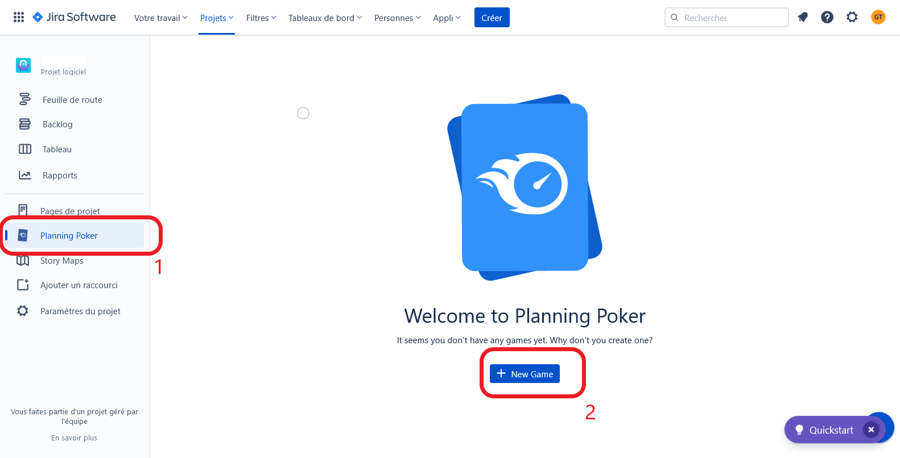
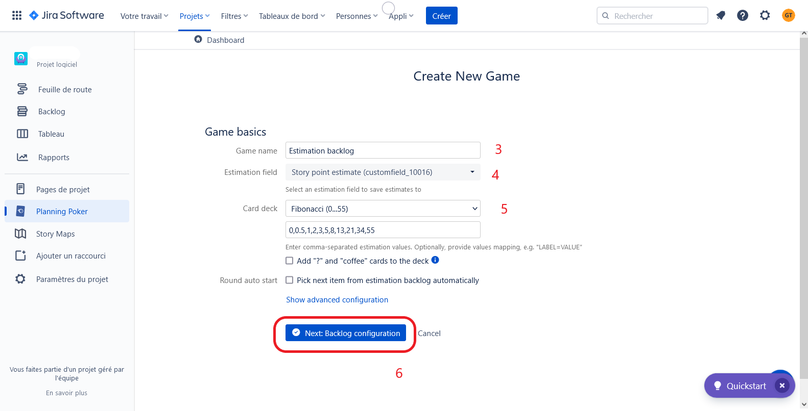
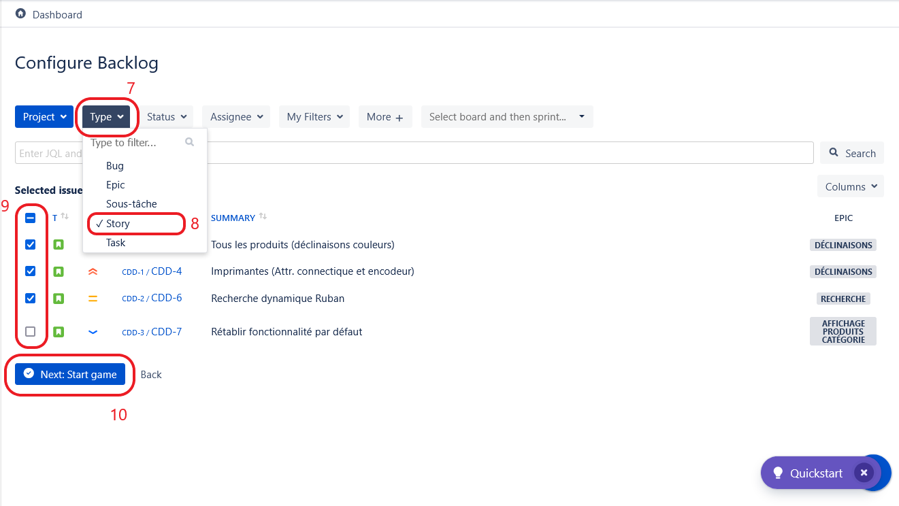
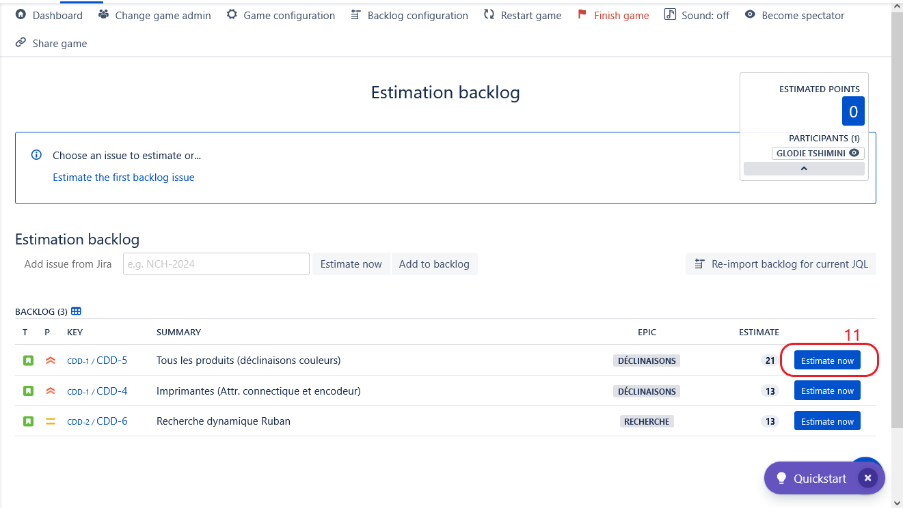
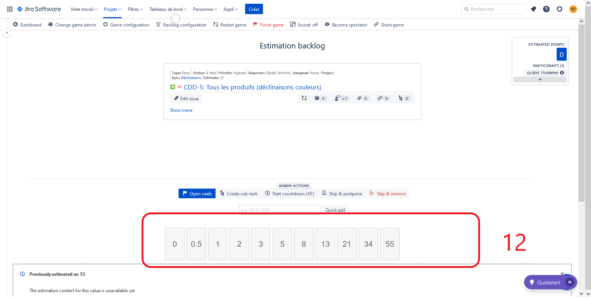

# Exercice 11 : estimations

---

## Instructions

### Avec le planning poker

- Utilisez le logiciel ***Jira***
- Utilisez l'extension *Planning Poker*

---

## Énoncé

À partir de votre *product backlog* : 

1. Priorisez vos *US*
2. Estimez la complexité des *US* les plus prioritaires (estimation d'au moins 5 tickets).
- Votez (estimez) en utilisant l'extension *Planning Poker*.
- En cas d'écart, confrontez les membres de l'équipe qui ont voté aux extrêmes (note la plus basse et note la plus élevée) pour avoir les arguments de chacun et revotez à nouveau en tenant compte de l'échange. Dans le cas ou vous n'arriveriez pas à vous mettre d'accord après le 3ème tour de vote sur le même ticket, alors mettez le score le plus élevée au ticket.

### Mise en place du Planning Poker

- Gardez la suite de Fibonacci pour les estimations avec uniquement les valeurs 1, 2, 3, 5, 8, 13 et 21.
- Après le vote, confrontez les membres de l'équipe qui ont voté aux extrêmes (note la plus basse et note la plus élevée) pour avoir les arguments de chacun et revotez pour avoir un consensus sur l'estimation.
En cas de débat, il faut time-boxer 1 à 3 min par personne ayant voté aux extrêmes pour argumenter son vote.

### Aide pour la configuration de l'extension *Planning Poker*

